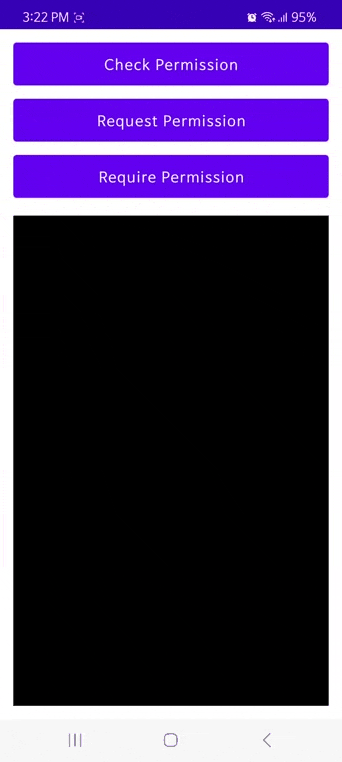

# LoganPermission

* Easy to use to check permissions and request runtime permissions.
* Considered the specificity of Android 11 (API 30) version or higher.
  - Deny twice for a permission in Android 11
  - User can cancel a permission request by hitting the "Back" button.
  - User can also clicking on the outside of the permission dialog to cancel.
* Provides event listeners for the three request methods. (Please refer to the usage below)
  - CheckPermissionListener
  - RequestPermissionListener
  - RequirePermissionListener

## Installation  [](https://jitpack.io/v/logansdk/logan-permission.svg)

```gradle
allprojects {
    repositories {
        ...
        maven { url 'https://jitpack.io' }
    }
}

dependencies {
    implementation 'com.github.logansdk:logan-permission:0.9.25'
}
```

## Usage

**NOTE:** 

* `PermissionManager.with(this, permissions)` the `this` parameter can be a Activity or a Fragment.
* There are three types of permission request results.
  - granted : Permission granted.
  - denied : Permission denied.
  - rejected : When a user can no longer request a permission that has been denied. (ask never again)

### Check permissions :

It only checks the status for granted and denied of the requested permission. (No permission request dialog)

```java
String[] permissions = new String[] {Manifest.permission.CAMERA, Manifest.permission.WRITE_EXTERNAL_STORAGE};

PermissionManager.with(this, permissions).check(new CheckPermissionListener()
{
    @Override
    public void onResult(ArrayList<String> granted, ArrayList<String> denied)
    {
        // Permission granted
        if (!granted.isEmpty())
            Log.d("LOG", granted.toString());

        // Permission denied
        if (!denied.isEmpty())
            Log.d("LOG", denied.toString());
    }
});
```

### Request Permission :

After all permission processing is completed, the result value for granted, denied, rejected.

```java
String[] permissions = new String[] {Manifest.permission.CAMERA, Manifest.permission.WRITE_EXTERNAL_STORAGE};

PermissionManager.with(this, permissions).check(new RequestPermissionListener()
{
    @Override
    public void onResult(ArrayList<String> granted, ArrayList<String> denied, ArrayList<String> rejected)
    {
        // Permission granted
        if (!granted.isEmpty())
            Log.d("LOG", granted.toString());

        // Permission denied
        if (!denied.isEmpty())
            Log.d("LOG", denied.toString());
            
        // Permission rejectd
        if (!rejectd.isEmpty())
            Log.d("LOG", rejectd.toString());
    }
});
```

### Require Permission :

After all permission processing is completed, one of the three events below is called.
 - onGranted : All rights granted
 - onDenied : At least one permission is denied
 - onRejected : At least one permission is rejected

```java
String[] permissions = new String[] {Manifest.permission.CAMERA, Manifest.permission.WRITE_EXTERNAL_STORAGE};

PermissionManager.with(this, permissions).check(new RequirePermissionListener()
{
    @Override
    public void onGranted()
    {
        // All rights granted
        Log.d("LOG", "All rights granted!");
        Toast.makeText(MainActivity.this, "All rights granted!", Toast.LENGTH_SHORT).show();
    }

    @Override
    public void onDenied(ArrayList<String> denied)
    {
        // At least one permission is denied
        Log.d("LOG", denied.toString());
        Toast.makeText(MainActivity.this, "Permissions must be granted.", Toast.LENGTH_SHORT).show();
    }

    @Override
    public void onRejected(ArrayList<String> rejected)
    {
        // At least one permission is rejected
        // Denied permission without ask never again
        Log.d("LOG", rejectd.toString());
        
        // The permission request dialog box can no longer be displayed
        showPermissionRationale(rejected);
    }
});
```

## Screenshots


## License

```
Copyright (C) 2023 Logan SDK

Licensed under the Apache License, Version 2.0 (the "License");
you may not use this file except in compliance with the License.
You may obtain a copy of the License at

   http://www.apache.org/licenses/LICENSE-2.0

Unless required by applicable law or agreed to in writing, software
distributed under the License is distributed on an "AS IS" BASIS,
WITHOUT WARRANTIES OR CONDITIONS OF ANY KIND, either express or implied.
See the License for the specific language governing permissions and
limitations under the License.
```
